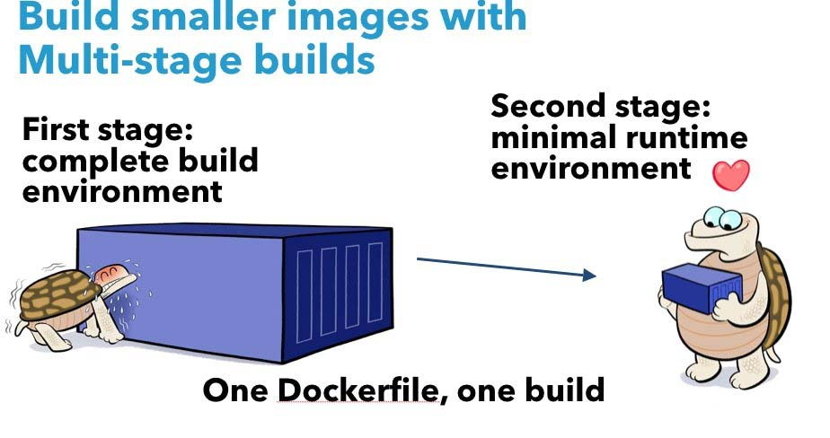
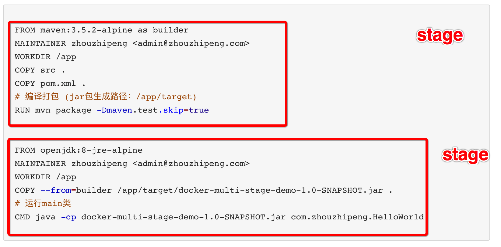
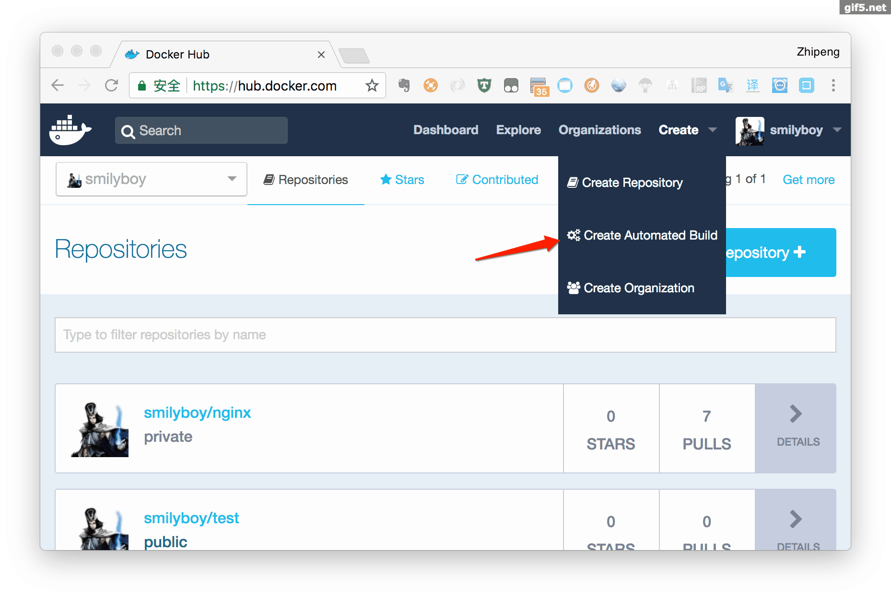

# 用Dockerfile打造你的自动化构建工具

## 前言

`自动化构建`是应用发布过程中必不可少的环节， 常用的构建工具有`jenkins` ,`walle` 等。而这些工具在构建应用时通常会有以下问题：

> 1. 需要直接或间接的写一坨用于构建的shell命令等，不易管理、兼容性较差
> 2. 上面一点可能还比较容易解决，但最为致命的是：重度依赖如`jenkins`宿主机或打包机上的软件环境，如`git`, `maven`,`java`等


理想情况是： 不同的应用如java应用、go应用、php应用等等，都可以在某台负责构建的宿主机上并行无干扰的执行构建操作，且构建中依赖的软件环境、构建流程等都可以由开发人员控制。


到目前为止，能很好的完成以上使命的，可能非[docker](https://blog.zhouzhipeng.com/category/docker)莫属了！


在docker的世界里，构建交付的是`镜像`,而能够产生镜像的是`Dockerfile` (手动使用`docker commit` 的另当别论).

在`docker ce 17.05` 之后，出现了一个很重要的特性`Multi-Stage Build`  (多阶段构建) , 它将显著提升你的运维生产力!


> 下文将用实战案例来详细解读`Multi-Stage Build`这一特性


## 在Multi-Stage Build之前

以下演示以`java` hello world 为例，完整代码在： [https://github.com/zhouzhipeng/docker-multi-stage-demo](https://github.com/zhouzhipeng/docker-multi-stage-demo)

这是一个标准的maven 项目，仅有个HelloWorld主类。大体构建思路为：


1. 在maven镜像中编译并打包项目
2. 将步骤1中生成的jar拷贝出来
3. 用步骤2得到的jar，在jre镜像中构建并运行jar中的主类


Dockerfile.build  用于编译和打包jar

```bash

FROM maven:3.5.2-alpine

MAINTAINER zhouzhipeng <admin@zhouzhipeng.com>

WORKDIR /app

COPY . .

# 编译打包
RUN mvn package -Dmaven.test.skip=true

```


Dockerfile.old 用于运行jar中的主类

```bash
FROM openjdk:8-jre-alpine

MAINTAINER zhouzhipeng <admin@zhouzhipeng.com>

WORKDIR /app

COPY docker-multi-stage-demo-1.0-SNAPSHOT.jar .

# 运行main类
CMD java -cp docker-multi-stage-demo-1.0-SNAPSHOT.jar com.zhouzhipeng.HelloWorld

```


注意到，两个dockerfile之间关联的 docker-multi-stage-demo-1.0-SNAPSHOT.jar  文件，需要另外一个build.sh 脚本来串起来.


build.sh

```bash
#!/usr/bin/env bash


# 1. 先构建出带有产物jar的镜像
docker build -t zhouzhipeng/dockermultistagedemo-build -f Dockerfile.build .

# 2. 临时创建 dockermultistagedemo-build 容器
docker create --name build zhouzhipeng/dockermultistagedemo-build

# 3. 将上面容器中的jar拷贝出来
docker cp build:/app/target/docker-multi-stage-demo-1.0-SNAPSHOT.jar ./

# 4. 构建java执行的镜像
docker build -t zhouzhipeng/dockermultistagedemo -f Dockerfile.old .

# 5. 删除临时jar文件
rm -rf docker-multi-stage-demo-1.0-SNAPSHOT.jar
```


对Dockerfile和shell也了解的朋友相信应该都看得懂，在此不做过多赘述.


## 在Multi-Stage Build之后

看过上一节后，你也许会感觉是不是有点麻烦呢？ 是的，麻烦之处在于不仅要写多个dockerfile，而且还需要一个build.sh 脚本来额外执行。 无疑是增大了构建应用的复杂度！

将上面的Dockerfile.build 和Dockerfile.old 结合起来，稍加修饰，得到如下全新的Dockerfile：

```bash

FROM maven:3.5.2-alpine as builder
MAINTAINER zhouzhipeng <admin@zhouzhipeng.com>
WORKDIR /app
COPY src .
COPY pom.xml .
# 编译打包 (jar包生成路径：/app/target)
RUN mvn package -Dmaven.test.skip=true


FROM openjdk:8-jre-alpine
MAINTAINER zhouzhipeng <admin@zhouzhipeng.com>
WORKDIR /app
COPY --from=builder /app/target/docker-multi-stage-demo-1.0-SNAPSHOT.jar .
# 运行main类
CMD java -cp docker-multi-stage-demo-1.0-SNAPSHOT.jar com.zhouzhipeng.HelloWorld

```

然后，仍然是熟悉的docker build命令

```bash
docker build -t zhouzhipeng/dockermultistagedemo-new .
```

即可。


细心的你应该不难发现，上面的Dockerfile 中有两处地方不一样，

1. 出现了多个`FROM ` 语句
2. `COPY` 命令后多了`--from=builder`


这就是今天的主咖 `Multi-Stage Build`  , 先来通过一张图来直观感受下什么是所谓的`Multi-Stage Build` (多阶段构建 ）：





通过多阶段构建，既可以保持Dockerfile简洁易读，又可以让最终的产物镜像很“干净”。


## 简单理解

还是以上文中的Dockerfile为例, 如下图所示：




红框中的部分可以看作是一个个独立的“stage” ，可以粗略想象成就是一个独立的Dockerfile内容。

大家知道镜像构建是一层一层叠加的，按照Dockerfile的命令行顺序，由上至下依次执行叠加。 所以，下层的stage才可以引用到上层的stage，为了方便引用到上层的stage，故需要给其取一个名字, 用`as` 操作符。

`FROM` 命令的完整格式如下：

```bash
FROM <image>[:<tag>] [AS <name>]
```

stage之间交互的是文件，故`COPY` 命令需要扩展，通过`--from=<name>` 来指定需要从上方的哪个"stage" 拷贝文件, 其完整命令格式如下：

```bash
COPY  --from=<name|index> <src>... <dest>
# 注意--from 是可选的，当上层的stage没有名字时可以按照index(从0开始)的顺序引用，eg. --from=0
```


值得一提的是，默认情况下使用`docker build` 命令构建一个包含多个stage的dockerfile时，最终的产物是最下方的一个stage 所产生的镜像。

当然，如果出于调试原因或其他需求，docker也是支持构建到指定的stage的，使用 `--target builder` 就可以只构建builder镜像。

```bash
docker build -t zhouzhipeng/builder --target builder .
```


## 最后一步

到目前为止，我们已经有了一个能够一键构建的Dockerfile 文件，接下来就只差让它能够自动构建了！

你可以用你熟悉的`jenkins` 结合github的webhook来实现提交一次代码，就执行一次docker build命令。

当然，我推荐个人体验的话就用官方的docker hub 吧，因为这样你构建的镜像还可以与他人共享。

具体的用Docker hub 的 automated build 功能就不详细说明了, 下面用一张gif图快速演示下，感兴趣的朋友可以自行去探索下。





## 总结

`Multi-Stage Build`  这一特性非常适合做构建管道流，对于那些依赖环境复杂、流程也复杂的应用来说最合适不过了。

可以clone下上面的源码试下哦：  [https://github.com/zhouzhipeng/docker-multi-stage-demo](https://github.com/zhouzhipeng/docker-multi-stage-demo)


## 参考文献

> [https://docs.docker.com/v17.09/engine/userguide/eng-image/multistage-build/](https://docs.docker.com/v17.09/engine/userguide/eng-image/multistage-build/)
>
> [https://blog.alexellis.io/mutli-stage-docker-builds/](https://blog.alexellis.io/mutli-stage-docker-builds/)