# CodingAir云服务开发平台使用帮助

> CodingAir云服务开发平台上线啦！地址：[http://codingair.com](http://codingair.com)
>
> 欢迎大家免费试用提意见哦！（测试账号：823143047@qq.com （我的邮箱）  密码：123456 , 也可以自行注册哦！)


## 背景介绍

### CodingAir云服务开发平台是个啥？

1. 如果只允许你写一个java函数来实现一个带有一定业务逻辑和复杂度的http接口，你可以做到吗？
2. 你是不是一直觉得在写完逻辑实现后还要编写接口文档简直是噩梦一般？因为你写的接口文档和代码实现是分开的！这种情况下再写接口文档确实是多余的累赘!
3. 因表结构频繁变更而困扰的老司机们，还记得每次加/改个字段所引起的一系列繁琐操作吗？（XMl配置变更、DTO变更、DAO变更、SERVICE 变更、VO变更 ....)


### 又一个轮子？

错了！[CodingAir云服务开发平台](http://codingair.com)不是轮子、不是一套新的框架，它只是帮助你解决上述的三个痛点，将开发、部署周期缩减到最短，用你熟悉的java语言、一系列你曾用过的工具包，将http接口开发精简到极致！


### 你的80%选择！

[CodingAir云服务开发平台](http://codingair.com)并不能解决业务开发的所有场景， 它也不想要解决所有业务场景，你仔细回忆一下，你写的80%的所谓业务逻辑是不是除了CRUD就只剩下if /else/ for ？

如果是，欢迎上车！[CodingAir云服务开发平台](http://codingair.com)正是你在寻找的那80%的最佳选择！


### 预备知识

1. 一定的java编程知识
2. 一定的sql操作知识


## 快速入门

### 1. 创建接口&文档

添加接口， 填入接口名称、接口路径等信息，提交保存.

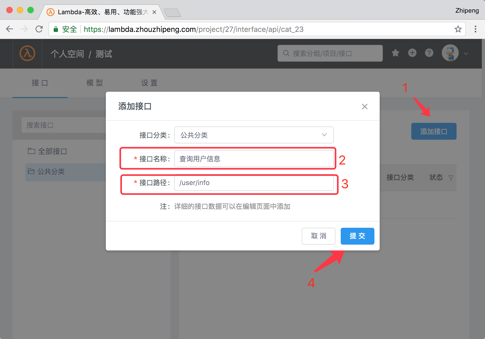


接口设置 ，进入【接口设置】 tab栏，设置请求和响应参数格式


设置请求提和响应体

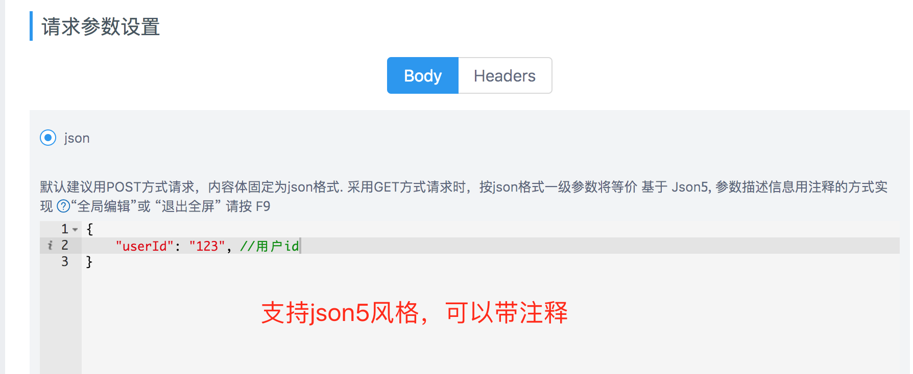


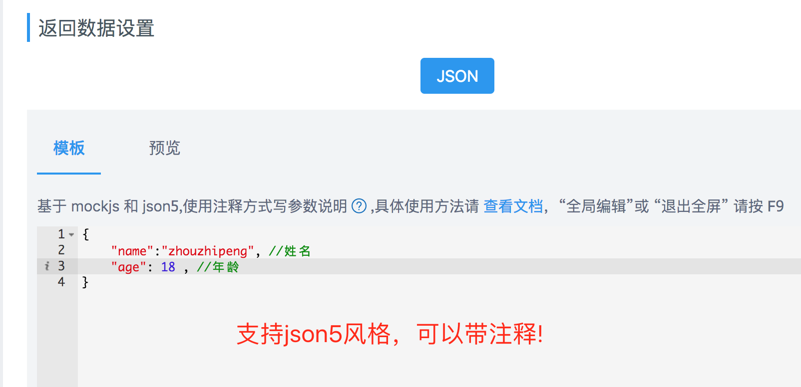


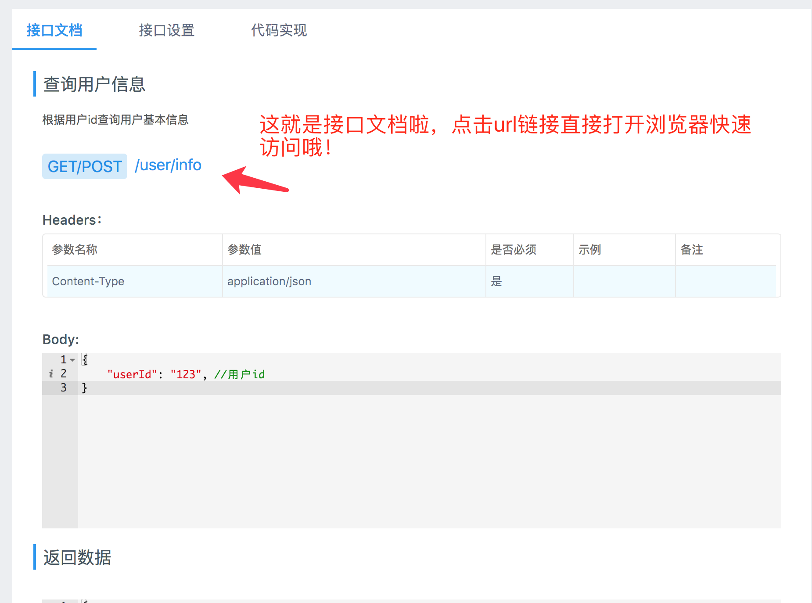


### 2. 打开浏览器访问接口吧！

可以直接点击接口文档中的 `/user/info` url链接即可打开浏览器标签页访问接口，接口固定host为： `https://api.zhouzhipeng.com`  , 后缀拼接上你定义的url即可。


### 3. 定制接口逻辑(划重点!)

你会发现现在你写的接口 `https://api.zhouzhipeng.com/user/info` 的返回数据是固定的，那么如何让它“动”起来呢？进入【代码实现】 tab栏

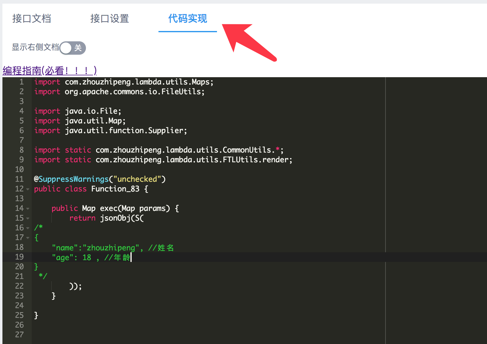


先不用管出现在你眼前的代码的具体逻辑，后面会详细介绍。 简单粗暴的，我们先将返回值的`name` 和`age` 改掉，如下图所示 ：

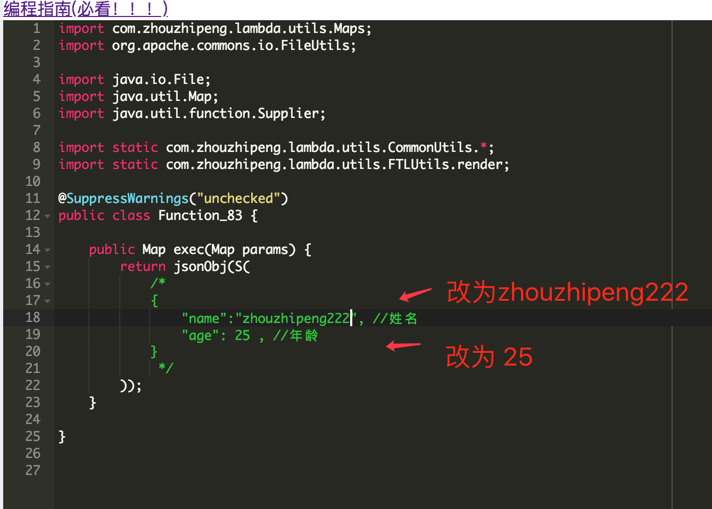


接着访问下 接口url(如果已打开过，记得刷新下浏览器):


或者你可以直接在【代码实现】栏的下方，点击“运行” 按钮，查看接口返回结果：

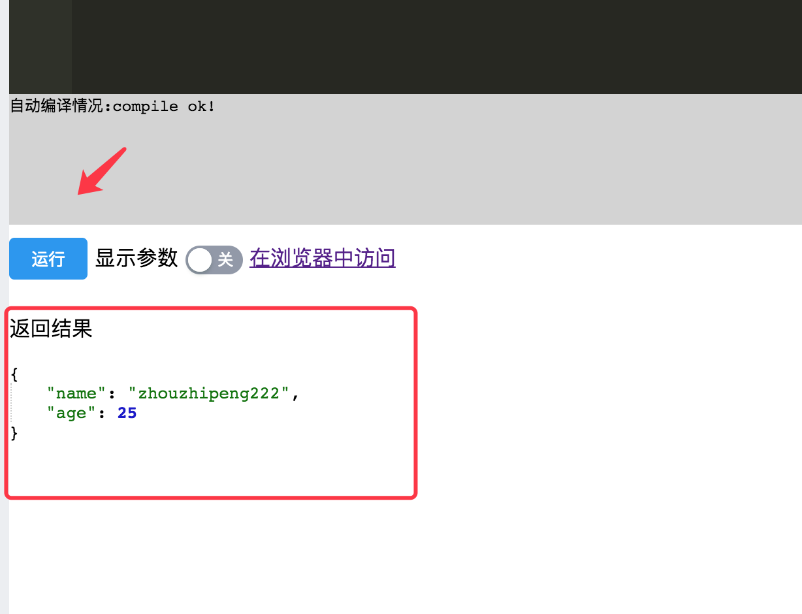


以上只是简单的逻辑定制，现实情况是我们经常性的要操作多张数据库表，客官请接着看下一节 【建个模型】


### 4. 建个模型（划重点!）

先进入【模型】页面， 模型是每个项目独享的，一个项目下的所有接口都可以操作模型。 你可以理解模型就是数据库中的表。


** ! 请务必按照图示的1、2、3 等操作顺序进行操作哦。


给模型添加字段，填完字段信息 要点一下图中红色箭头“+” 号按钮哦！

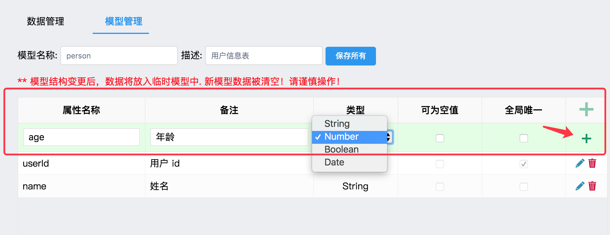


最后一步： 别忘了点【保存所有】按钮啊！！！

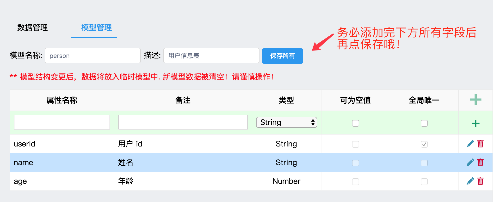


为了待会接口查询方便， 我们给模型加点测试数据：


​

请按图示步骤进行添加，可以多加两条。（数据添加完是及时保存的哦，不要担心 ~~）


好了，客官，有了模型，赶紧用起来吧，详情见下一节！


### 5. 在接口中使用模型（划重点!）

以下的操作可能跟你的传统编程习惯很不一样，它将挑战你的mvc三层思想，化繁为简，先破后立！

让我们直接还原编程的本质吧！ 操作数据！


为了防止你手动敲代码有错误，下面贴一下 `return` 代码块

```java
 return Maps.of("list",sql(S(
            /*
            select * from person
             */
        )));
```


点一下下方的【运行】 按钮！


事情还没完 ！  你还记得你曾经填写的接口的请求参数吗？

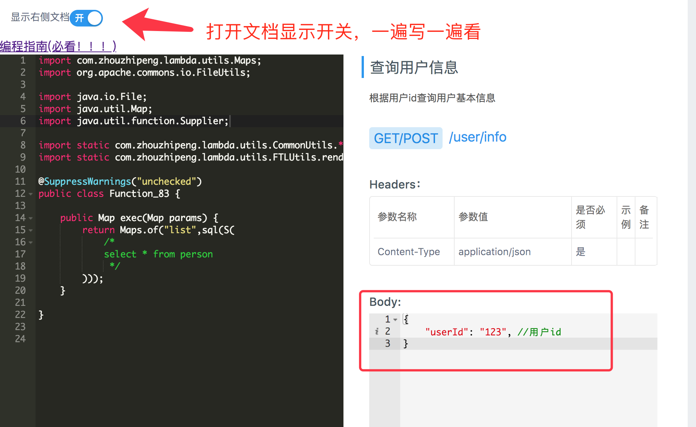


让我们尝试在代码中使用参数：

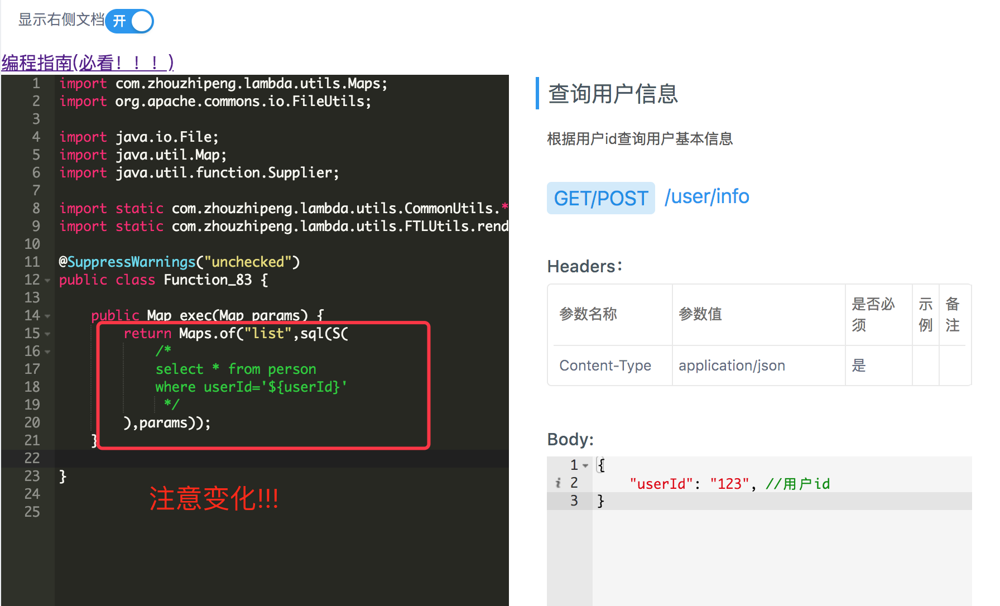


`return` 部分代码参考：

```java
 return Maps.of("list",sql(S(
            /*
            select * from person
            where userId='${userId}'
             */
        ),params));
```


接着让我们运行一下：

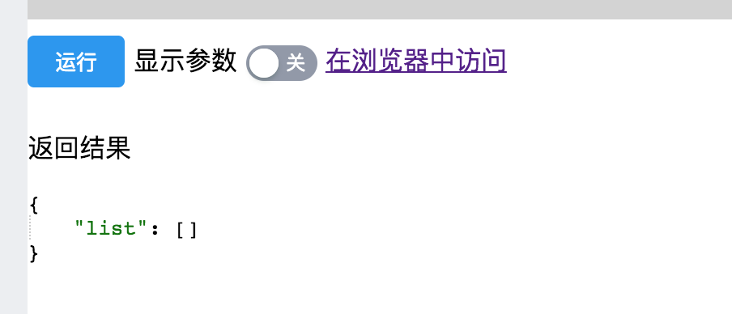


额 打脸了？为啥没数据呢？ 打开 上图中的 【显示参数】 开关看一下：

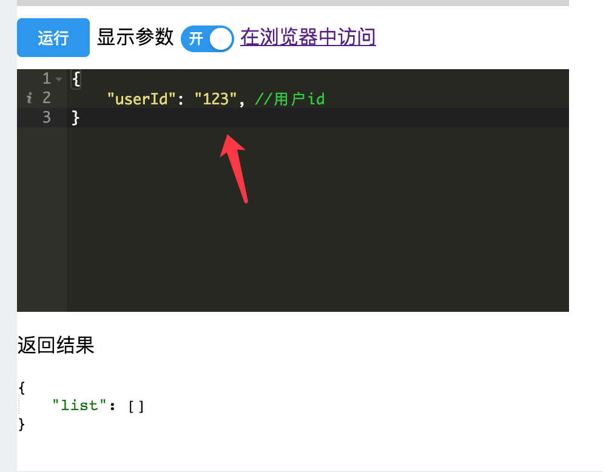


如果你的记忆力够好，你应该能发现前面在添加模型测试数据的时候确实没有用户id 为"123" 的用户。 没关系，我们试着改下入参为"1" ，然后再点击【运行】 按钮试一下：


当然你还可以改为 "2" 或其他你刚在模型中添加的useId看一下。 最后你也可以点击【在浏览器中访问】 链接：


啥？谁说只能用`GET` 形式访问？？ 上 `Postman` ！！

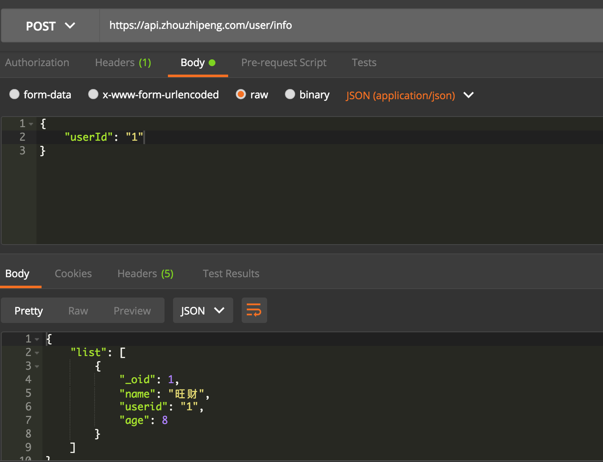


你想的没错，所有通过[CodingAir云服务开发平台](http://codingair.com)创建的接口都是支持 `GET`  和 `POST` 两种请求方式的， post形式请求体是标准的json，get形式 参数名固定为 `_` ， 参数值为 json字符串经过url编码之后的值。


是不是感觉已经很神奇了？！ 可以明确告诉你，所有这些都不是魔法，所有的一切都是基于你的最爱-JAVA 来创建的！

想知道其中的一些细节和特性？请接着往下看【编程指南】吧！


## 编程指南
 ** 可用的maven依赖： [CodingAir云服务开发平台-可用的maven依赖](https://blog.zhouzhipeng.com/lambda-available-maven-dependencies.html)

 ** 常用的工具类CommonUtils:   [CodingAir云服务开发平台-CommonUtils](https://blog.zhouzhipeng.com/lambda-platform-commonutils.html)


### 1. 如果Java可以有多行字符串？！

在【快速入门】章节你也许有注意到，无论在返回json格式响应体还是写sql时都是用的java标准 多行注释来写的！

正常情况下java是不支持标准字符串的多行形式的，而[CodingAir云服务开发平台](http://codingair.com/) 会采用比较优雅的方式来实现 - 多行注释。

使用`S` 函数来包裹一个 /* xxx  */ 这种类型的多行注释，将在调用时解析成一个标准java字符串。


### 2. sql操作就是这么简单！

很多有多年编程经验的“大神”们也许会觉得像下面这样把sql语句写到了所谓的“controller”层很不优雅！ 很不和谐！很不能接受！

```java
 public Map exec(Map params) {
        return Maps.of("list",sql(S(
            /*
            select * from person
            where userId='${userId}'
             */
        ),params));
    }

```

我只想说你有那么多时间去维护所谓的MVC三层的代码，维护放sql的xml、维护方操作的dao、维护大部分情况下只是无修改的调dto的service？为什么就不能省一点时间去陪陪老婆孩子？少加点班呢？


> 我个人觉得，编程的本质就是解决某类问题，而函数的本质是交换数据、实现输入输出。


既然如此，[CodingAir云服务开发平台](http://codingair.com)就是很好的一种选择，它强调的更是一种函数化的思想而非一种模式。

从今天开始，请大胆的直接操作你的数据吧！每个人都应该有自信能控制好，而不是靠一堆无聊繁重的多文件、模式的约束！


讲回正题，`sql` 函数接受标准的java字符串参数（`S` 函数将多行注释处理之后返回的就是标准java字符串），或者可选的上下文map。

```java
/**
     * sql操作
     * @param sqlTemplate
     * @param contexts
     * @param <T>
     * @return
     */
    public static <T> T sql(String sqlTemplate, Map<String, Object>... contexts)
```


sql语句中可以包含 形如`${...}` 这种占位符，其内部将使用freemarker进行渲染(详情见下一小节)，渲染所需的数据来源于 `contenxts` 参数。可以有多个context map，当多个map中key的名字有相同时，将使用最后一个context map中的值。

关于`sql`函数的返回值, 你也许有注意到这是个泛型`T` , 让你的sqlTemplate 是一个select语句时，你可以这样接受参数:

```java
List<Object> resultList=sql("select * from person") ;
//或者为了操作方便可以这样
com.alibaba.fastjson.JSONArray resultList=sql("select * from person") ;
```

select查询 的结果是一个json array。可以在【代码实现】 页面中自行体验。


当sqlTemplate 是一个`非select`语句时 (任意update, delete , insert ), `T` 是一个 `int ` 类型  ，告诉你实际影响的行数。

```java
int effectCount=sql("update person ...") ;
```


### 3. 你应该知道的Freemarker模板知识!

查看官方文档： [http://freemarker.foofun.cn/](http://freemarker.foofun.cn/)


