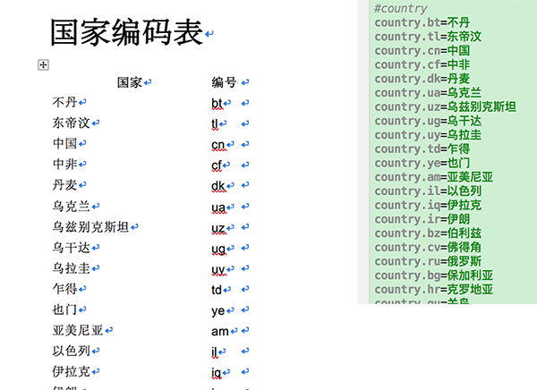
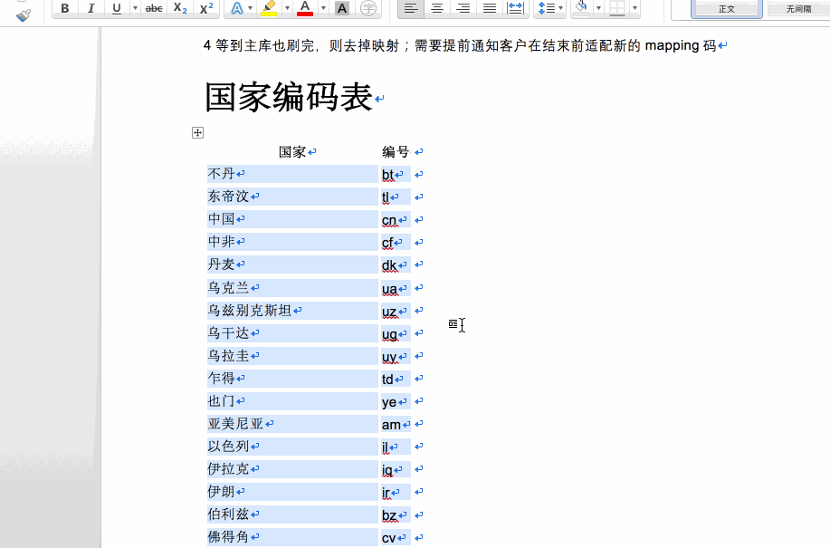
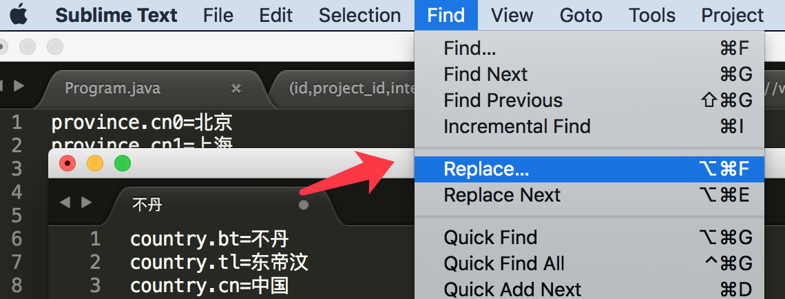
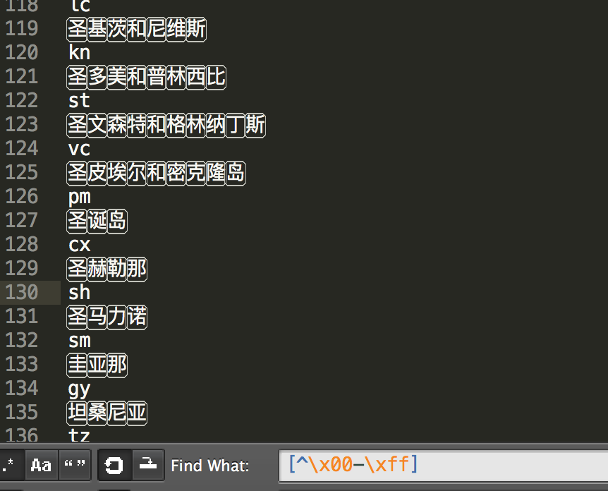
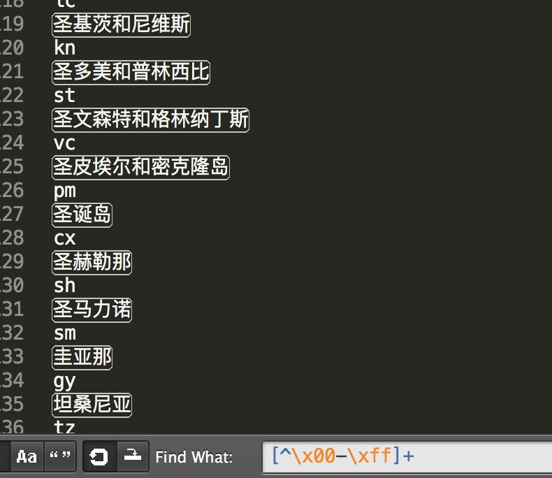
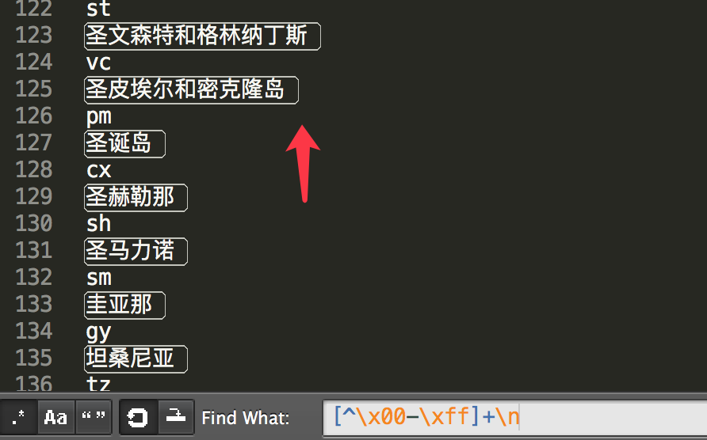
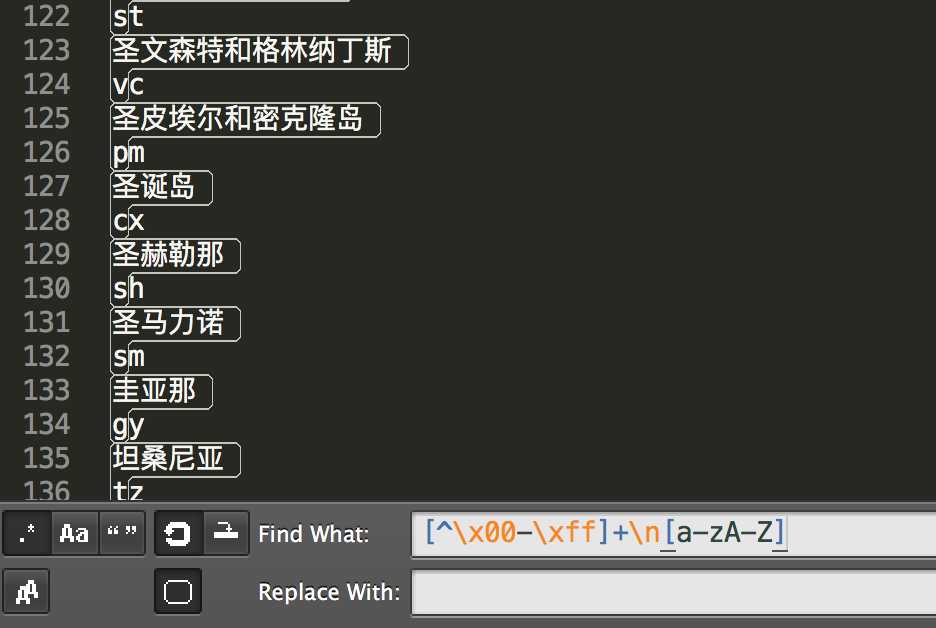
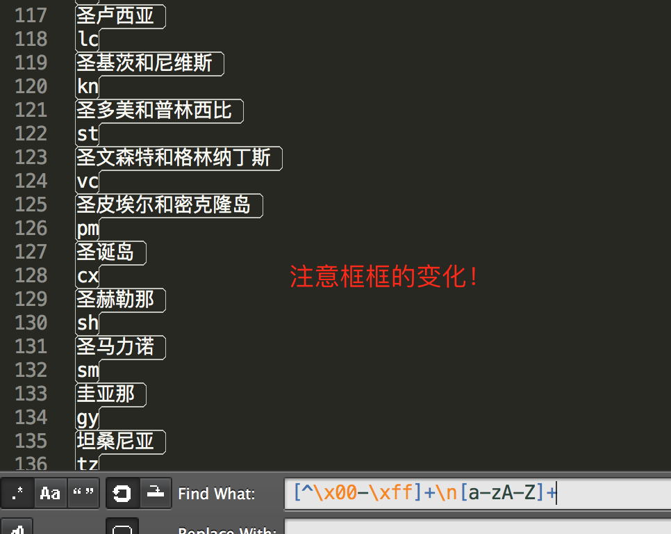
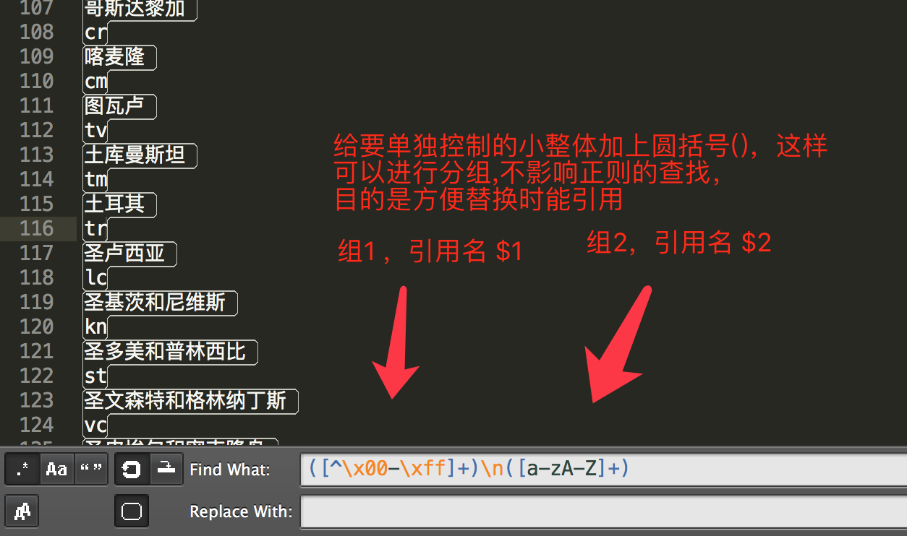
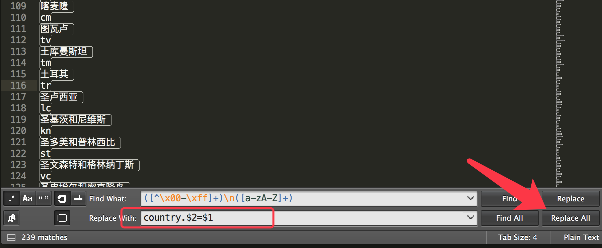

# 巧用SublimeText和正则表达式，让操作飞起来！

## 背景

> SublimeText 是一款mac上的文本编辑器，类似于windows上的notepad++或者editplus等。

>正则表达式是对文本进行查找、替换等处理的规则表达式，详情：[http://www.runoob.com/regexp/regexp-intro.html](http://www.runoob.com/regexp/regexp-intro.html)

今天收到一个小需求需要把图中左边word文档里的国家、省、城市等值更新并转成右边的格式：




需求不是很难，但是我感觉为这个转换单独写一段程序稍微有点杀鸡用牛刀了！


那么，就想办法直接在文本编辑器中弄吧！


## 演示

gif图片可能有点大，请耐心等待。。




## 分解说明

对正则表达式的比较熟的人，应该看完就懂了，直接拿走不写  ?

```bash
匹配正则：([^\x00-\xff]+)\n([a-zA-Z]+)
替换为：country.$2=$1\n  (这里末尾的\n可以不用)

匹配空行: ^(\s*)\n
替换为：  (空，什么都不输入)
```

附上部分原字符串（从word文档拷贝出来就成了下面这样），方便试验一下：

```html
不丹
bt
东帝汶
tl
中国
cn
中非
cf
丹麦
dk
乌克兰
ua
乌兹别克斯坦
uz
乌干达
ug
乌拉圭
uy
乍得
td
```


对SublimeText和正则都不熟的客官请接着往下看：（请务必要看图片的哦！）

1. sublime text 编辑器操作

   


注意打开替换操作栏后，下面箭头处的地方记得要勾上哦(这表示启用正则模式)：


`Find What`栏是要匹配的字符串的正则，`Replace With` 栏是要替换“为”的正则。


正则拆解说明:

```bash
匹配正则：([^\x00-\xff]+)\n([a-zA-Z]+)
替换为：country.$2=$1
```

1.匹配单个中文字符




2.匹配多个中文字符(比第一步多个"+",表示“+”紧挨着的左边字符可以出现一个或多个的意思)




3.匹配换行符 (linux/mac上是 `\n` , windows 上是 `\r\n` )




请留意编辑器中字符周围的“框框 ”的变化！


4.匹配单个英文字符（这里只有a-z的小写字母其实)




5.匹配多个英文字符（同理 末尾加上"+")




6.分组方便引用（不是为了分组而分组，方便替换时可以引用）




7.引用分组，完成替换




